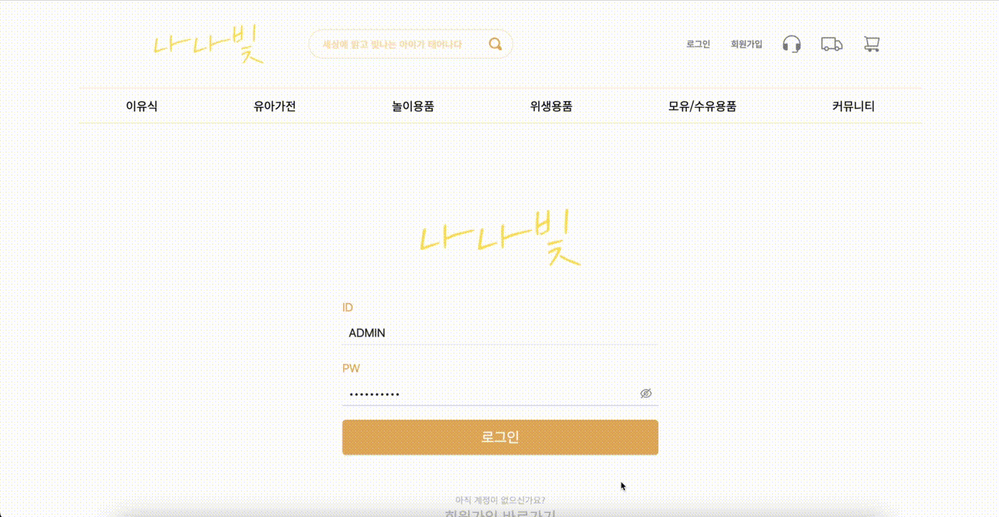

# 2차 프로젝트 유아용품쇼핑몰 - 나나빛

<h3>시연영상</h3>

 

      
    

    
        🔹
        <a herf="https://www.youtube.com/watch?v=QSKiyPgRrgo" target="_blank">
            시연 영상 바로가기
        </a>
    

---

<h3>배포</h3>

    
        <a href="http://192.168.0.144:5227/" target="_blank">
            사이트 바로가기
        </a>
    

---

### 프로젝트 정보

- [FE_Notion](https://wood-onyx-616.notion.site/2-3-35eebf3e408949bca9d14b46898de209?pvs=4)
- [Figma](https://www.figma.com/file/2LF6tijPo3RfGidZy3dFKw/%EB%82%98%EB%82%98%EB%B9%9B?type=design&node-id=54695%3A25741&mode=design&t=fMG7jYuCzvQ4zrEb-1)
- [Canvas](https://www.canva.com/design/DAF7cAd55q4/zjtbiY0R7UnDk2lfO_1zvg/view?utm_content=DAF7cAd55q4&utm_campaign=designshare&utm_medium=link&utm_source=editor)

<h4>기획 목적</h4>
- 현대 사회에서 부모들은 자녀를 키우면서 다양한 어려움에 부딪힙니다. 이러한 어려움을 해소하고 편의를 제공하기 위한 유아용품 쇼핑몰

<h4>주요기능 및 특징</h4>
- 이유식 가이드 제공, 유아제품 이용, 식기세척기 사용가이드 
- 회원가입 (개인화 서비스 : 내자녀 개월수, 성별, 알레르기), 약관서비스 DB화 
- 1대1 문의 
- 검색기능 

### 프로젝트 기간

- 2024.01.04 ~ 2023.02.06

---

## 개발파트

#### 김주영 (팀장)

- git 관리
- 공용 컴포넌트(header, footer)
- Router 관리
- Figma 작업
- 주문내역, 취소/환불 page
- 카테고리 page
- 검색 page

#### 김민수 (팀원)

Login , Cart , MyPage

- 로그인 page
- 장바구니 page
- MyPage
- Not Found 페이지 구현
- 공용 component

#### 남건이 (팀원)

main, order, orderComplete Page

- Figma 작업
- 메인 page
- 주문 page
- 주문상세 page

#### 최동환 (팀원)

item, sign up, modify, modifyPw페이지

- 노션 관리
- 회원가입 page
- 회원 정보수정 page
- 상품 상세 page

#### 백경국 (팀원)

- 커뮤니티 page CRUD 작업 (1대1문의, 공지사항, 소통커뮤니티)
- 기획서

---

## Front-End 기술 스택

    <h3>📚 Front Tech Stack 📚</h3>
    
✨ Platforms & Languages ✨

    
    
    
    
    
    
    
    
    
    
    
    
     

 

    
🛠 Tools 🛠

    
    
    
   
    
    
    
    

---

## 프로젝트 후기

##### 좋았던점

- 백엔드와 협업을 하며 데이터를 가져오고 보내는 경험을 해볼 수 있었다.
- 초기 UI/UX 구성이 중요하다라는것을 느꼇다.
- 프로젝트를 계기로 모달에 대한 이해도가 상승한것같다.
- probs에 대한 이해가 상승한것같다.

##### 아쉬웠던점

- 아직도 데이터 연동은 너무 어렵다고 느낀다.공부를 좀 더 할 시간이 주어졌음 좋겠다고 생각도 들지만, 협업을 통해 소통하는 방법을 배워 만족한다.
- Cart Page를 하면서 전역상태관리 라이브러리의 필요성을 한번 더 느끼는 계기가 되었던 것 같다.
  3차때는 좀 더 공부하고 노력해야겠다.
- 사진 업로드하는 부분이 어렵다 느껴졌고 데이터 연동하는 부분을 조금 더 공부해야 할 것 같다.
- 여전히 많이 부족하다는 걸 뼈저리게 느끼고 제자리걸음중인 것 같아서 많은 생각을 하게 되는 계기였다. 3차때는 더 나은 실력이 되도록 노력해야겠다.
- 리액트의 여러 가지 라이브러리를 적용하고 싶었지만 너무 어려웠다. 라이브러리 활용 능력을 키워야겠다.
